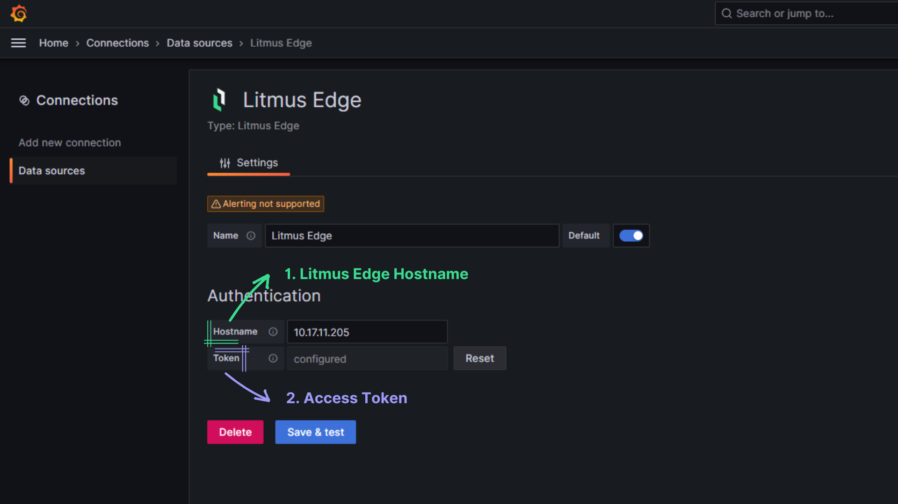
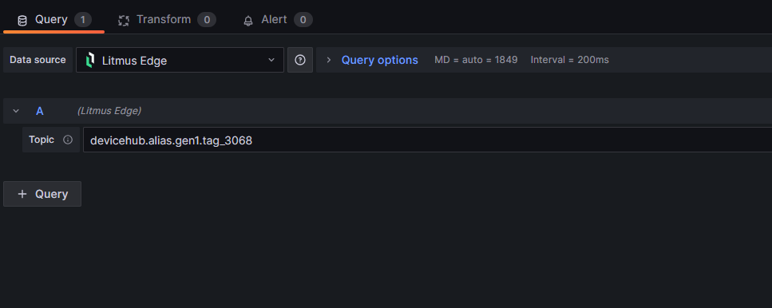

# Litmus edge data source for Grafana

The Litmus Edge data source plugin enables the visualization of real time data streaming from the edge in Grafana.

## Requirements

- Grafana v8.0+
- Litmus Edge v3.16.x
- [Litmus Edge API Account](https://docs.litmus.io/litmusedge/product-features/system/access-control/tokens/create-api-account)

> [!NOTE]
> Make sure [NATS proxy](https://docs.litmus.io/litmusedge/product-features/system/access-control/tokens/create-api-account) is enabled and has read access to the topics.

## Configure the data source

[Add a new data source](https://grafana.com/docs/grafana/latest/datasources/add-a-data-source/) and select Litmus Edge. To configure the data source, you need to provide the following fields:

- **Hostname**: The hostname of the Litmus Edge instance.
- **Token**: The [token](https://docs.litmus.io/litmusedge/product-features/system/tokens/create-api-account) to authenticate with the Litmus Edge instance.

## Stream data from the edge

To stream data from the edge, you need to create a new query and provide the following fields:

- **Topic**: The topic name to fetch the data from.

> - The plugin supports topics publishing numbers, strings, boolean, and JSON objects. Use the `Extract Fields` transformation to extract the fields from the JSON object.
> - The plugin automatically adds the `timestamp` field to the query result if it is not present in the topic data.
> - The plugin automatically adds the topic context for Devicehub tags.
> - Wildcard topics are not allowed.
